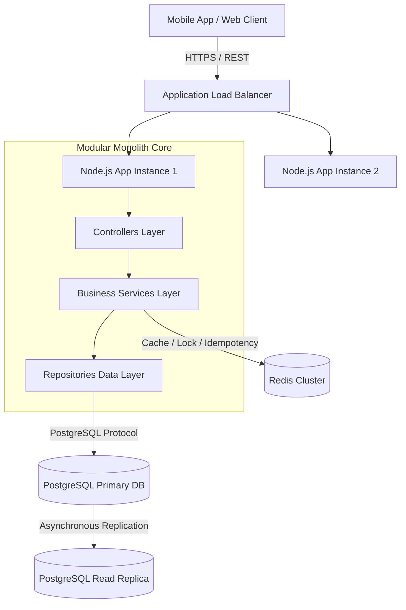
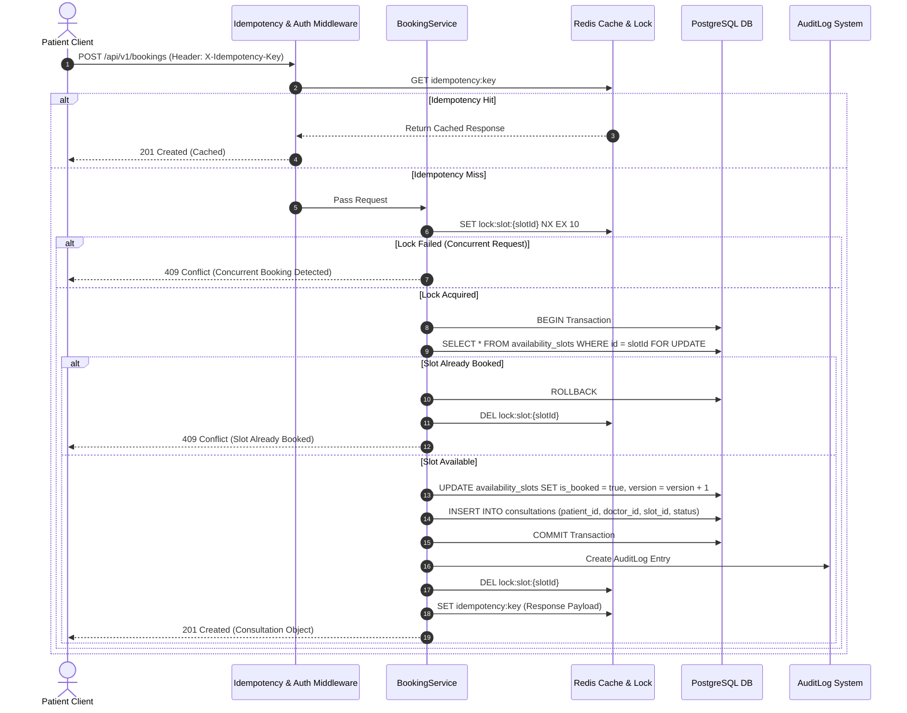
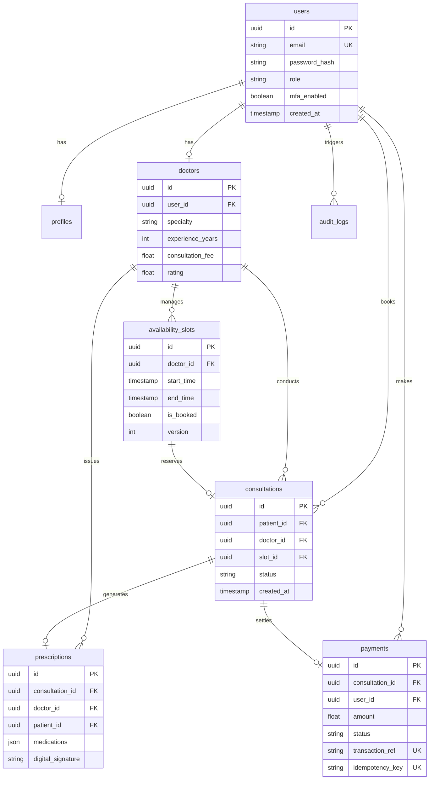

# Amrutam Telemedicine Backend Architecture Document

## 1. System Overview

The Amrutam Telemedicine platform provides a production-grade, high-concurrency backend API for online doctor consultations, prescription management, patient scheduling, and administrative analytics.

The system is designed as a **Modular Monolith** built with Node.js (TypeScript), Express, PostgreSQL, and Redis. It targets **100,000 daily consultations**, maintaining **p95 read latency < 200ms**, **p95 write latency < 500ms**, and **99.95% availability**.

---

## 2. High-Level Architecture Diagram

---

## 3. Data Flow

1. **Authentication**: User submits credentials -> `AuthController` -> `AuthService` verifies BCrypt hash -> Issues signed JWT Access (1d) & Refresh (7d) tokens -> Audit log recorded.
2. **Doctor Search**: Client queries `/doctors/search` -> `DoctorService` checks Redis cache (`doctors:search:*`). On cache miss, queries indexed PostgreSQL database -> Stores result in Redis -> Returns payload.
3. **Slot Booking**: Client sends `POST /bookings` with `X-Idempotency-Key` -> `IdempotencyMiddleware` checks Redis. `BookingService` acquires Redis distributed lock (`lock:slot:{slotId}`) -> Runs atomic PostgreSQL `SELECT FOR UPDATE` transaction -> Marks slot booked & creates consultation -> Releases lock -> Emits metrics.

---

## 4. Booking Flow Sequence Diagram

---

## 5. Entity-Relationship (ER) Diagram

---

## 6. Concurrency & Double Booking Prevention Strategy

Double booking is prevented through a multi-tiered protection architecture:

1. **Redis Distributed Locks**: Requests targeting a specific `slot_id` must acquire `lock:slot:{slot_id}` via atomic `SET ... NX EX 10`. If another thread holds the lock, immediate 409 Conflict is returned.
2. **PostgreSQL Explicit Row Locking (`SELECT FOR UPDATE`)**: Transactions lock the target slot row during validation.
3. **Database Unique Constraints**: `availability_slots` enforces a `UNIQUE(doctor_id, start_time)` index constraint. `consultations` enforces a `UNIQUE(slot_id)` foreign key constraint.
4. **Optimistic Locking / Versioning**: Updates specify `WHERE id = slot_id AND is_booked = false AND version = current_version`.

---

## 7. Idempotency Strategy

- Write requests accept an optional `X-Idempotency-Key` header.
- `IdempotencyMiddleware` stores execution state in Redis under `idempotency:{key}`:
  - Phase 1: Sets value `PROCESSING` (TTL 60s). Concurrent duplicate requests receive `409 Conflict`.
  - Phase 2: Upon successful route handler completion, caches status code and JSON payload for 24 hours.
  - Phase 3: Retried requests receive exact cached response without re-executing business logic.

---

## 8. Backup & Disaster Recovery (DR) Strategy

- **RPO (Recovery Point Objective)**: < 5 minutes (WAL archiving with AWS Aurora PostgreSQL).
- **RTO (Recovery Time Objective)**: < 15 minutes (Automated failover across Multi-AZ deployment).
- **Backups**: Daily automated full snapshot retained for 30 days; continuous point-in-time recovery (PITR).
- **Redis DR**: Redis configured with RDB snapshots every 15 minutes + AOF appendonly enabled. In case of cold restart, application uses in-memory fallback gracefully without failing requests.
